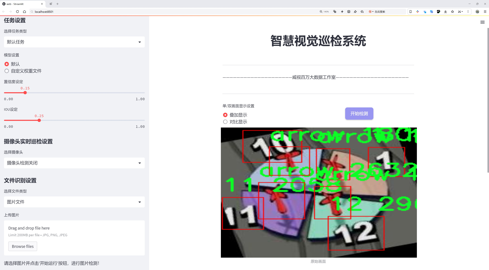
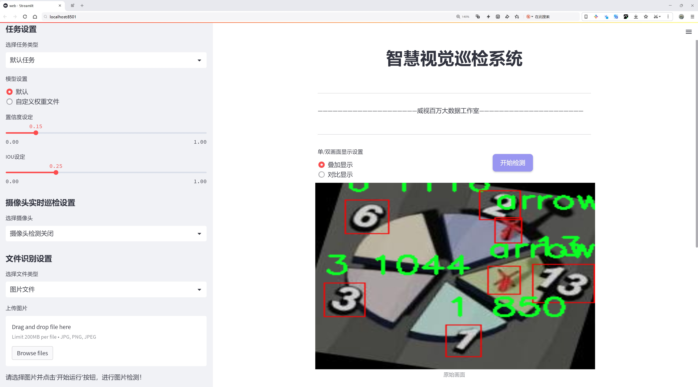
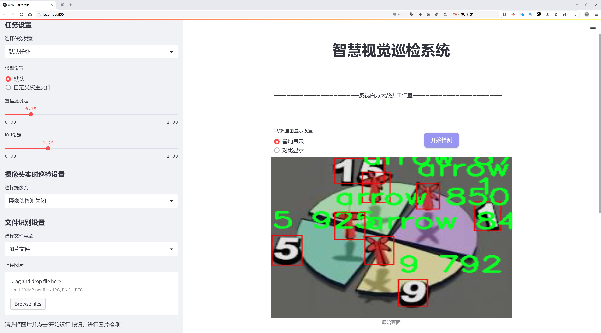
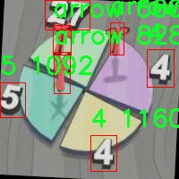
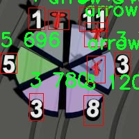
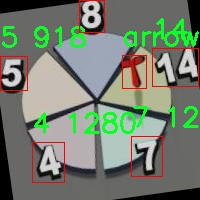
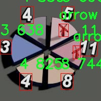
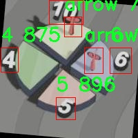

# 箭头与数字识别检测系统源码分享
 # [一条龙教学YOLOV8标注好的数据集一键训练_70+全套改进创新点发刊_Web前端展示]

### 1.研究背景与意义

项目参考[AAAI Association for the Advancement of Artificial Intelligence](https://gitee.com/qunmasj/projects)

项目来源[AACV Association for the Advancement of Computer Vision](https://kdocs.cn/l/cszuIiCKVNis)

研究背景与意义

在当今快速发展的科技时代，计算机视觉技术的应用日益广泛，尤其是在物体检测和识别领域。YOLO（You Only Look Once）系列模型因其高效性和实时性，成为了目标检测任务中的重要工具。YOLOv8作为该系列的最新版本，进一步提升了检测精度和速度，为复杂场景下的物体识别提供了更为可靠的解决方案。然而，针对特定应用场景的改进和优化仍然是当前研究的热点之一。本研究旨在基于改进YOLOv8模型，构建一个高效的箭头与数字识别系统，以满足特定领域的需求。

箭头与数字的识别在多个领域中具有重要的应用价值，尤其是在智能交通、自动化生产、体育分析等场景中。以体育分析为例，箭头和数字的准确识别能够帮助教练和运动员更好地理解比赛策略和运动表现。此外，在工业自动化中，箭头和数字的实时检测可以提升生产效率和安全性。因此，构建一个高效的箭头与数字识别系统，不仅可以推动相关领域的技术进步，还能够为实际应用提供强有力的支持。

本研究所使用的数据集包含1800张图像，涵盖30个类别，其中包括数字（1至29）和箭头。这一数据集的构建为模型的训练和测试提供了丰富的样本，确保了模型在多样化场景下的适应性和鲁棒性。通过对这些数据的深入分析和处理，能够有效提升模型的识别能力，尤其是在处理复杂背景和不同光照条件下的表现。

在改进YOLOv8模型的过程中，我们将重点关注以下几个方面：首先，优化模型的网络结构，以提高特征提取的效率和准确性；其次，针对箭头和数字的特征，设计特定的损失函数，以增强模型对这类目标的敏感性；最后，通过数据增强技术，提升模型在小样本情况下的泛化能力。这些改进措施将有助于提升系统的整体性能，使其在实际应用中更具竞争力。

综上所述，基于改进YOLOv8的箭头与数字识别系统的研究，不仅具有重要的理论意义，还具有广泛的应用前景。通过对该系统的深入研究与开发，我们期望能够为相关领域提供更为高效、准确的识别工具，推动智能化技术的进一步发展。同时，本研究也将为后续的计算机视觉研究提供新的思路和方法，促进学术界与产业界的深度融合。

### 2.图片演示







##### 注意：由于此博客编辑较早，上面“2.图片演示”和“3.视频演示”展示的系统图片或者视频可能为老版本，新版本在老版本的基础上升级如下：（实际效果以升级的新版本为准）

  （1）适配了YOLOV8的“目标检测”模型和“实例分割”模型，通过加载相应的权重（.pt）文件即可自适应加载模型。

  （2）支持“图片识别”、“视频识别”、“摄像头实时识别”三种识别模式。

  （3）支持“图片识别”、“视频识别”、“摄像头实时识别”三种识别结果保存导出，解决手动导出（容易卡顿出现爆内存）存在的问题，识别完自动保存结果并导出到tempDir中。

  （4）支持Web前端系统中的标题、背景图等自定义修改，后面提供修改教程。

  另外本项目提供训练的数据集和训练教程,暂不提供权重文件（best.pt）,需要您按照教程进行训练后实现图片演示和Web前端界面演示的效果。

### 3.视频演示

[3.1 视频演示](https://www.bilibili.com/video/BV1VgsQesEoJ/)

### 4.数据集信息展示

##### 4.1 本项目数据集详细数据（类别数＆类别名）

nc: 30
names: ['1', '10', '11', '12', '13', '14', '15', '16', '17', '18', '19', '2', '20', '21', '22', '23', '24', '25', '26', '27', '28', '29', '3', '4', '5', '6', '7', '8', '9', 'arrow']


##### 4.2 本项目数据集信息介绍

数据集信息展示

在本研究中，我们使用了名为“polat-dart-solver”的数据集，以训练和改进YOLOv8模型，专注于箭头与数字的识别系统。该数据集的设计旨在支持高效的图像识别任务，尤其是在体育和游戏场景中，涉及到飞镖运动的应用。数据集包含30个类别，涵盖了从数字“1”到“29”的所有单个数字，以及“arrow”这一类目，代表箭头的形状和方向。这种丰富的类别设置为模型提供了多样化的训练样本，能够有效提升其在复杂场景下的识别能力。

在数据集的构建过程中，研究团队确保了样本的多样性和代表性。每个数字类别都包含了不同的字体、颜色和背景，以模拟实际应用中可能遇到的各种情况。这种多样性不仅增强了模型的泛化能力，还使其能够在不同的光照条件和拍摄角度下，准确识别目标。特别是在飞镖比赛中，选手投掷飞镖的角度和速度变化都可能影响图像的捕捉，因此数据集中的样本经过精心挑选，以确保模型能够适应这些变化。

数据集中的“arrow”类别同样至关重要，因为箭头不仅是飞镖游戏中得分的指示符号，也是视觉识别系统中需要特别关注的元素。箭头的方向、形状和颜色变化都可能影响最终的识别结果，因此在数据集中包含了多种样式的箭头图像。这种设计使得模型在实际应用中，能够更准确地判断飞镖的投掷方向和得分区域。

为了进一步提升模型的性能，数据集还包含了大量的标注信息。每个图像都经过详细的标注，标注信息包括类别标签和边界框坐标。这些信息不仅为模型的训练提供了必要的监督信号，还为后续的模型评估和性能分析奠定了基础。通过使用这些标注数据，研究人员能够定量分析模型在不同类别上的表现，识别出可能的改进方向。

在训练过程中，数据集的规模和多样性使得模型能够在多轮迭代中不断优化。通过不断调整模型参数和结构，研究团队期望实现更高的识别精度和更快的处理速度。最终目标是构建一个能够实时识别飞镖比赛中箭头和数字的系统，为选手和观众提供即时的得分反馈和分析。

综上所述，“polat-dart-solver”数据集为改进YOLOv8的箭头与数字识别系统提供了坚实的基础。其丰富的类别设置、多样的样本以及详细的标注信息，确保了模型在实际应用中的有效性和可靠性。通过对该数据集的深入研究和应用，我们期待能够推动飞镖运动的数字化和智能化进程，为相关领域的研究和实践提供新的思路和方法。











### 5.全套项目环境部署视频教程（零基础手把手教学）

[5.1 环境部署教程链接（零基础手把手教学）](https://www.ixigua.com/7404473917358506534?logTag=c807d0cbc21c0ef59de5)


[5.2 安装Python虚拟环境创建和依赖库安装视频教程链接（零基础手把手教学）](https://www.ixigua.com/7404474678003106304?logTag=1f1041108cd1f708b01a)

### 6.手把手YOLOV8训练视频教程（零基础小白有手就能学会）

[6.1 手把手YOLOV8训练视频教程（零基础小白有手就能学会）](https://www.ixigua.com/7404477157818401292?logTag=d31a2dfd1983c9668658)

### 7.70+种全套YOLOV8创新点代码加载调参视频教程（一键加载写好的改进模型的配置文件）

[7.1 70+种全套YOLOV8创新点代码加载调参视频教程（一键加载写好的改进模型的配置文件）](https://www.ixigua.com/7404478314661806627?logTag=29066f8288e3f4eea3a4)

### 8.70+种全套YOLOV8创新点原理讲解（非科班也可以轻松写刊发刊，V10版本正在科研待更新）

由于篇幅限制，每个创新点的具体原理讲解就不一一展开，具体见下列网址中的创新点对应子项目的技术原理博客网址【Blog】：


[8.1 70+种全套YOLOV8创新点原理讲解链接](https://gitee.com/qunmasj/good)

### 9.系统功能展示（检测对象为举例，实际内容以本项目数据集为准）

图9.1.系统支持检测结果表格显示

  图9.2.系统支持置信度和IOU阈值手动调节

  图9.3.系统支持自定义加载权重文件best.pt(需要你通过步骤5中训练获得)

  图9.4.系统支持摄像头实时识别

  图9.5.系统支持图片识别

  图9.6.系统支持视频识别

  图9.7.系统支持识别结果文件自动保存

  图9.8.系统支持Excel导出检测结果数据


### 10.原始YOLOV8算法原理

原始YOLOv8算法原理

YOLOv8（You Only Look Once version 8）是目标检测领域的最新突破，作为YOLO系列的最新版本，它在继承前代模型优点的基础上，进行了诸多创新和改进，使得其在精度和速度上均表现出色。YOLOv8的设计理念是实现高效、准确的目标检测，同时保持模型的轻量化和易用性，适应各种硬件平台的需求。

YOLOv8的核心结构由三部分组成：Backbone、Neck和Head。Backbone部分负责特征提取，采用了CSPDarknet（Cross Stage Partial Darknet）结构，这种结构通过跨阶段的特征共享和部分连接，极大地提高了特征提取的效率和效果。与YOLOv5相比，YOLOv8引入了C2f模块替代了C3模块。C2f模块的设计理念是将输入特征图分为两个分支，每个分支通过卷积层进行降维处理，这种设计不仅提高了特征图的维度，也增强了梯度流的信息传递，确保了网络在训练过程中的稳定性和有效性。

在特征提取的过程中，YOLOv8还引入了快速空间金字塔池化（SPPF）结构，这一创新使得模型能够在多尺度上提取特征，显著提升了对不同尺寸目标的检测能力。SPPF通过减少参数量和计算量，进一步优化了模型的性能，使得YOLOv8在处理高分辨率图像时依然能够保持高效的计算速度。

Neck部分则采用了特征金字塔网络（FPN）和路径聚合网络（PAN）的组合，这一结构通过多层卷积和池化操作，处理和压缩特征图，形成丰富的多尺度特征表示。Neck的设计使得YOLOv8能够有效整合来自不同层次的特征信息，提升了目标检测的准确性和鲁棒性。

在Head部分，YOLOv8采用了无锚框（Anchor-Free）的检测方式，直接预测目标的中心点和宽高比例。这一方法不仅减少了对Anchor框的依赖，还提高了检测速度和准确度。通过解耦的分类和回归分支，YOLOv8能够更加灵活地处理不同类型的目标，尤其是在复杂场景下的表现尤为突出。

YOLOv8的损失函数设计也进行了重要的改进。新引入的变焦损失（Focal Loss）策略，使得模型在训练过程中能够更加关注难以检测的目标，提升了分类的准确性。同时，数据平均保真度损失和完美交并比损失的结合，使得边界框的回归更加精确。这些创新的损失策略使得YOLOv8在面对复杂的目标检测任务时，能够展现出更高的灵活性和适应性。

此外，YOLOv8还借鉴了YOLOv5、YOLOv6和YOLOX等模型的设计优点，进一步优化了模型结构，确保了在各种应用场景下的高效性和准确性。YOLOv8不仅支持姿态评估，还能够有效处理小目标检测和高分辨率图像的检测任务，这使得其在实际应用中具有更广泛的适用性。

综上所述，YOLOv8在目标检测领域的创新和改进，使其成为当前最先进的模型之一。通过高效的特征提取、灵活的目标检测方式以及优化的损失函数，YOLOv8在精度和速度上均超越了以往的模型，为计算机视觉的各类应用提供了强有力的支持。无论是在工业检测、智能监控还是自动驾驶等领域，YOLOv8都展现出了卓越的性能，标志着目标检测技术的又一次飞跃。


### 11.项目核心源码讲解（再也不用担心看不懂代码逻辑）

#### 11.1 ui.py

以下是经过精简和注释的核心代码：

```python
import sys
import subprocess
from QtFusion.path import abs_path

def run_script(script_path):
    """
    使用当前 Python 环境运行指定的脚本。

    Args:
        script_path (str): 要运行的脚本路径
    """
    # 获取当前 Python 解释器的路径
    python_path = sys.executable

    # 构建运行命令，使用 streamlit 运行指定的脚本
    command = f'"{python_path}" -m streamlit run "{script_path}"'

    # 执行命令并捕获结果
    result = subprocess.run(command, shell=True)
    
    # 检查脚本运行是否成功
    if result.returncode != 0:
        print("脚本运行出错。")

# 主程序入口
if __name__ == "__main__":
    # 获取要运行的脚本的绝对路径
    script_path = abs_path("web.py")

    # 调用函数运行脚本
    run_script(script_path)
```

### 代码说明：
1. **导入模块**：
   - `sys`：用于获取当前 Python 解释器的路径。
   - `subprocess`：用于执行外部命令。
   - `abs_path`：从 `QtFusion.path` 导入的函数，用于获取文件的绝对路径。

2. **`run_script` 函数**：
   - 参数 `script_path`：传入要运行的脚本的路径。
   - 使用 `sys.executable` 获取当前 Python 解释器的路径。
   - 构建命令字符串，使用 `streamlit` 运行指定的脚本。
   - 使用 `subprocess.run` 执行命令，并检查返回码以判断脚本是否成功运行。

3. **主程序入口**：
   - 当脚本作为主程序运行时，获取 `web.py` 的绝对路径，并调用 `run_script` 函数来执行该脚本。

这个程序文件 `ui.py` 的主要功能是运行一个指定的 Python 脚本，具体来说是使用 Streamlit 框架来启动一个 Web 应用。程序的结构比较简单，主要包含几个部分。

首先，文件导入了一些必要的模块，包括 `sys`、`os` 和 `subprocess`。其中，`sys` 模块用于访问与 Python 解释器相关的变量和函数，`os` 模块提供了与操作系统交互的功能，而 `subprocess` 模块则用于执行外部命令。

接下来，程序定义了一个名为 `run_script` 的函数。这个函数接收一个参数 `script_path`，表示要运行的脚本的路径。在函数内部，首先获取当前 Python 解释器的路径，使用 `sys.executable` 来实现。然后，构建一个命令字符串，该命令用于通过 Streamlit 运行指定的脚本。命令的格式是 `"{python_path}" -m streamlit run "{script_path}"`，其中 `{python_path}` 和 `{script_path}` 分别被当前 Python 解释器的路径和脚本路径替换。

接着，使用 `subprocess.run` 方法来执行构建好的命令。这个方法会在新的子进程中运行命令，并等待其完成。如果命令执行的返回码不为 0，表示脚本运行出错，程序会打印出相应的错误信息。

最后，在文件的主程序部分，使用 `if __name__ == "__main__":` 来确保只有在直接运行该文件时才会执行以下代码。这里指定了要运行的脚本路径，调用 `abs_path` 函数来获取 `web.py` 的绝对路径。然后，调用 `run_script` 函数来运行这个脚本。

总的来说，这个文件的主要作用是提供一个简单的接口来启动一个基于 Streamlit 的 Web 应用，方便用户在当前 Python 环境中运行指定的脚本。

#### 11.2 code\ultralytics\models\fastsam\model.py

以下是代码中最核心的部分，并附上详细的中文注释：

```python
from pathlib import Path  # 导入Path类，用于处理文件路径
from ultralytics.engine.model import Model  # 从ultralytics库中导入Model类
from .predict import FastSAMPredictor  # 导入FastSAMPredictor类，用于预测
from .val import FastSAMValidator  # 导入FastSAMValidator类，用于验证

class FastSAM(Model):
    """
    FastSAM模型接口。

    示例：
        ```python
        from ultralytics import FastSAM

        model = FastSAM('last.pt')  # 创建FastSAM模型实例，加载指定的模型文件
        results = model.predict('ultralytics/assets/bus.jpg')  # 对指定图片进行预测
        ```
    """

    def __init__(self, model="FastSAM-x.pt"):
        """初始化FastSAM类，调用父类Model的初始化方法，并设置默认模型。"""
        # 如果传入的模型名是"FastSAM.pt"，则将其替换为"FastSAM-x.pt"
        if str(model) == "FastSAM.pt":
            model = "FastSAM-x.pt"
        # 确保传入的模型文件后缀不是.yaml或.yml，FastSAM模型只支持预训练模型
        assert Path(model).suffix not in (".yaml", ".yml"), "FastSAM models only support pre-trained models."
        # 调用父类Model的初始化方法，设置模型和任务类型为"segment"
        super().__init__(model=model, task="segment")

    @property
    def task_map(self):
        """返回一个字典，将分割任务映射到相应的预测器和验证器类。"""
        return {"segment": {"predictor": FastSAMPredictor, "validator": FastSAMValidator}}
```

### 代码核心部分说明：
1. **导入模块**：代码首先导入了处理文件路径的`Path`类，以及YOLO模型的基类`Model`，以及用于预测和验证的类`FastSAMPredictor`和`FastSAMValidator`。

2. **FastSAM类**：定义了一个名为`FastSAM`的类，继承自`Model`类，表示FastSAM模型的接口。

3. **初始化方法**：在`__init__`方法中，设置了默认模型，并确保模型文件的格式正确。调用父类的初始化方法来完成模型的设置。

4. **任务映射**：`task_map`属性返回一个字典，映射了分割任务到相应的预测器和验证器类，便于后续的任务处理。

这个程序文件定义了一个名为 `FastSAM` 的类，它是基于 Ultralytics YOLO 框架的一个模型接口，主要用于图像分割任务。文件首先导入了必要的模块，包括 `Path` 类用于处理文件路径，以及从 `ultralytics.engine.model` 导入的 `Model` 类，后者是所有模型的基类。此外，还导入了 `FastSAMPredictor` 和 `FastSAMValidator`，分别用于预测和验证。

在 `FastSAM` 类的文档字符串中，提供了一个简单的使用示例，展示了如何加载模型并对图像进行预测。用户可以通过传入模型文件名（如 `last.pt`）来实例化 `FastSAM` 对象，并使用 `predict` 方法对指定的图像进行处理。

构造函数 `__init__` 接受一个模型文件名参数，默认值为 `FastSAM-x.pt`。在构造函数中，如果传入的模型名是 `FastSAM.pt`，则将其替换为 `FastSAM-x.pt`。接着，程序会检查传入的模型文件名后缀，确保它不是 YAML 格式，因为 `FastSAM` 模型只支持预训练模型。最后，调用父类 `Model` 的构造函数，传入模型名和任务类型（此处为 "segment"）。

`task_map` 属性返回一个字典，映射了分割任务到相应的预测器和验证器类。这使得在进行不同任务时，可以方便地获取对应的处理类，增强了代码的可扩展性和灵活性。整体来看，这个文件为 FastSAM 模型的使用提供了一个清晰的接口，便于用户进行图像分割任务。

#### 11.3 70+种YOLOv8算法改进源码大全和调试加载训练教程（非必要）\ultralytics\utils\callbacks\neptune.py

以下是代码中最核心的部分，并附上详细的中文注释：

```python
# 导入必要的库
from ultralytics.utils import LOGGER, SETTINGS, TESTS_RUNNING

# 尝试导入 NeptuneAI 相关库并进行初始化
try:
    assert not TESTS_RUNNING  # 确保不是在测试环境中
    assert SETTINGS['neptune'] is True  # 确保已启用 Neptune 集成
    import neptune
    from neptune.types import File

    assert hasattr(neptune, '__version__')  # 确保 Neptune 版本可用

    run = None  # 初始化 NeptuneAI 实验记录实例

except (ImportError, AssertionError):
    neptune = None  # 如果导入失败，则将 neptune 设置为 None


def _log_scalars(scalars, step=0):
    """将标量数据记录到 NeptuneAI 实验记录器中。"""
    if run:  # 如果 run 实例存在
        for k, v in scalars.items():  # 遍历标量字典
            run[k].append(value=v, step=step)  # 记录标量值和步骤


def _log_images(imgs_dict, group=''):
    """将图像记录到 NeptuneAI 实验记录器中。"""
    if run:  # 如果 run 实例存在
        for k, v in imgs_dict.items():  # 遍历图像字典
            run[f'{group}/{k}'].upload(File(v))  # 上传图像文件


def on_pretrain_routine_start(trainer):
    """在训练例程开始之前调用的回调函数。"""
    try:
        global run
        # 初始化 Neptune 运行
        run = neptune.init_run(project=trainer.args.project or 'YOLOv8', name=trainer.args.name, tags=['YOLOv8'])
        # 记录超参数配置
        run['Configuration/Hyperparameters'] = {k: '' if v is None else v for k, v in vars(trainer.args).items()}
    except Exception as e:
        LOGGER.warning(f'WARNING ⚠️ NeptuneAI 安装但未正确初始化，未记录此运行。 {e}')


def on_train_epoch_end(trainer):
    """每个训练周期结束时调用的回调函数。"""
    _log_scalars(trainer.label_loss_items(trainer.tloss, prefix='train'), trainer.epoch + 1)  # 记录训练损失
    _log_scalars(trainer.lr, trainer.epoch + 1)  # 记录学习率
    if trainer.epoch == 1:  # 如果是第一个周期
        # 记录训练批次的图像
        _log_images({f.stem: str(f) for f in trainer.save_dir.glob('train_batch*.jpg')}, 'Mosaic')


def on_train_end(trainer):
    """训练结束时调用的回调函数。"""
    if run:  # 如果 run 实例存在
        # 记录最终结果、混淆矩阵和 PR 图
        files = [
            'results.png', 'confusion_matrix.png', 'confusion_matrix_normalized.png',
            *(f'{x}_curve.png' for x in ('F1', 'PR', 'P', 'R'))]
        files = [(trainer.save_dir / f) for f in files if (trainer.save_dir / f).exists()]  # 过滤存在的文件
        for f in files:
            _log_plot(title=f.stem, plot_path=f)  # 记录图表
        # 记录最终模型
        run[f'weights/{trainer.args.name or trainer.args.task}/{str(trainer.best.name)}'].upload(File(str(trainer.best)))

# 定义回调函数字典
callbacks = {
    'on_pretrain_routine_start': on_pretrain_routine_start,
    'on_train_epoch_end': on_train_epoch_end,
    'on_train_end': on_train_end} if neptune else {}
```

### 代码说明：
1. **导入和初始化**：代码首先导入必要的库，并尝试初始化 NeptuneAI 实验记录器。如果导入失败，则将 `neptune` 设置为 `None`，以避免后续代码出错。
2. **记录标量和图像**：定义了 `_log_scalars` 和 `_log_images` 函数，用于将训练过程中的标量数据和图像上传到 NeptuneAI。
3. **回调函数**：定义了多个回调函数，如 `on_pretrain_routine_start`、`on_train_epoch_end` 和 `on_train_end`，这些函数在训练的不同阶段被调用，以记录相关信息。
4. **回调字典**：最后，将回调函数存储在一个字典中，以便在训练过程中调用。

这个程序文件是用于集成NeptuneAI实验日志记录的回调函数，主要用于YOLOv8模型的训练过程中的数据记录和可视化。文件首先导入了一些必要的模块和库，包括Ultralytics的日志记录器和设置参数。接着，它尝试导入Neptune库，并检查是否在测试运行中以及Neptune集成是否启用。如果导入失败或条件不满足，则将Neptune设置为None。

文件中定义了一些私有函数，主要用于记录标量数据、图像和绘图。`_log_scalars`函数用于将标量数据记录到Neptune中，`_log_images`函数用于上传图像，`_log_plot`函数则用于记录绘图，接收标题和图像路径作为参数。

接下来，文件定义了一些回调函数，这些函数在训练的不同阶段被调用。`on_pretrain_routine_start`函数在训练开始前被调用，用于初始化Neptune运行并记录超参数配置。`on_train_epoch_end`函数在每个训练周期结束时被调用，记录训练损失和学习率，并在第一轮结束时上传训练图像。`on_fit_epoch_end`函数在每个训练和验证周期结束时被调用，记录模型信息和训练指标。`on_val_end`函数在验证结束时被调用，记录验证图像。最后，`on_train_end`函数在训练结束时被调用，记录最终结果和混淆矩阵等可视化图像，并上传最佳模型的权重。

最后，文件将这些回调函数组织成一个字典，只有在Neptune集成可用的情况下才会使用这些回调。这种设计使得YOLOv8模型的训练过程能够方便地记录和可视化实验数据，便于后续分析和调试。

#### 11.4 train.py

以下是经过简化和注释的核心代码部分，主要集中在YOLO检测模型的训练过程。

```python
import random
import numpy as np
import torch.nn as nn
from ultralytics.data import build_dataloader, build_yolo_dataset
from ultralytics.engine.trainer import BaseTrainer
from ultralytics.models import yolo
from ultralytics.nn.tasks import DetectionModel
from ultralytics.utils import LOGGER, RANK
from ultralytics.utils.torch_utils import de_parallel, torch_distributed_zero_first

class DetectionTrainer(BaseTrainer):
    """
    扩展自BaseTrainer类，用于基于检测模型的训练。
    """

    def build_dataset(self, img_path, mode="train", batch=None):
        """
        构建YOLO数据集。

        参数:
            img_path (str): 包含图像的文件夹路径。
            mode (str): 模式为`train`或`val`，用户可以为每种模式自定义不同的增强。
            batch (int, optional): 批次大小，适用于`rect`模式。默认为None。
        """
        gs = max(int(de_parallel(self.model).stride.max() if self.model else 0), 32)  # 获取模型的最大步幅
        return build_yolo_dataset(self.args, img_path, batch, self.data, mode=mode, rect=mode == "val", stride=gs)

    def get_dataloader(self, dataset_path, batch_size=16, rank=0, mode="train"):
        """构造并返回数据加载器。"""
        assert mode in ["train", "val"]  # 确保模式有效
        with torch_distributed_zero_first(rank):  # 在分布式环境中仅初始化一次数据集
            dataset = self.build_dataset(dataset_path, mode, batch_size)
        shuffle = mode == "train"  # 训练模式下打乱数据
        workers = self.args.workers if mode == "train" else self.args.workers * 2  # 根据模式设置工作线程数
        return build_dataloader(dataset, batch_size, workers, shuffle, rank)  # 返回数据加载器

    def preprocess_batch(self, batch):
        """对图像批次进行预处理，包括缩放和转换为浮点数。"""
        batch["img"] = batch["img"].to(self.device, non_blocking=True).float() / 255  # 将图像转换为浮点数并归一化
        if self.args.multi_scale:  # 如果启用多尺度
            imgs = batch["img"]
            sz = (
                random.randrange(self.args.imgsz * 0.5, self.args.imgsz * 1.5 + self.stride)
                // self.stride
                * self.stride
            )  # 随机选择新的尺寸
            sf = sz / max(imgs.shape[2:])  # 计算缩放因子
            if sf != 1:
                ns = [
                    math.ceil(x * sf / self.stride) * self.stride for x in imgs.shape[2:]
                ]  # 计算新的形状
                imgs = nn.functional.interpolate(imgs, size=ns, mode="bilinear", align_corners=False)  # 调整图像大小
            batch["img"] = imgs
        return batch

    def get_model(self, cfg=None, weights=None, verbose=True):
        """返回YOLO检测模型。"""
        model = DetectionModel(cfg, nc=self.data["nc"], verbose=verbose and RANK == -1)  # 创建检测模型
        if weights:
            model.load(weights)  # 加载权重
        return model

    def plot_training_samples(self, batch, ni):
        """绘制带有注释的训练样本。"""
        plot_images(
            images=batch["img"],
            batch_idx=batch["batch_idx"],
            cls=batch["cls"].squeeze(-1),
            bboxes=batch["bboxes"],
            paths=batch["im_file"],
            fname=self.save_dir / f"train_batch{ni}.jpg",
            on_plot=self.on_plot,
        )

    def plot_metrics(self):
        """从CSV文件中绘制指标。"""
        plot_results(file=self.csv, on_plot=self.on_plot)  # 保存结果图
```

### 代码注释说明：
1. **类定义**：`DetectionTrainer`类继承自`BaseTrainer`，用于实现YOLO模型的训练功能。
2. **数据集构建**：`build_dataset`方法负责构建YOLO数据集，接受图像路径、模式和批次大小作为参数。
3. **数据加载器**：`get_dataloader`方法构造数据加载器，确保在分布式训练中只初始化一次数据集。
4. **批处理预处理**：`preprocess_batch`方法对输入的图像批次进行归一化和尺寸调整，以适应模型输入。
5. **模型获取**：`get_model`方法返回一个YOLO检测模型，并可选择加载预训练权重。
6. **绘图功能**：`plot_training_samples`和`plot_metrics`方法用于可视化训练样本和训练指标，便于分析模型性能。

这个程序文件 `train.py` 是一个用于训练目标检测模型的脚本，主要基于 YOLO（You Only Look Once）模型。它继承自 `BaseTrainer` 类，专注于构建和训练 YOLO 模型，具体功能和流程如下。

首先，文件导入了一些必要的库和模块，包括数学运算、随机数生成、深度学习框架 PyTorch 相关的模块，以及 Ultralytics 提供的数据处理、模型构建和训练的工具。

`DetectionTrainer` 类是该文件的核心，提供了多个方法来实现数据集构建、数据加载、模型预处理、模型设置、模型获取、验证器获取、损失项处理、训练进度字符串生成、训练样本绘制和指标绘制等功能。

在 `build_dataset` 方法中，程序根据传入的图像路径和模式（训练或验证）构建 YOLO 数据集。它会根据模型的步幅（stride）来确定数据集的最大步幅，并调用 `build_yolo_dataset` 函数来创建数据集。

`get_dataloader` 方法则用于构建数据加载器，确保在分布式训练中只初始化一次数据集，并根据模式决定是否打乱数据顺序。该方法还会根据模式调整工作线程的数量。

`preprocess_batch` 方法负责对图像批次进行预处理，包括将图像缩放到合适的大小并转换为浮点数格式。若启用了多尺度训练，它会随机选择一个尺寸进行缩放。

`set_model_attributes` 方法用于设置模型的属性，包括类别数量和类别名称等，确保模型与数据集的配置信息一致。

`get_model` 方法用于返回一个 YOLO 检测模型，并可选择加载预训练权重。

`get_validator` 方法返回一个用于验证 YOLO 模型的验证器，并定义了损失名称。

`label_loss_items` 方法返回一个包含标记训练损失项的字典，便于后续的损失监控和分析。

`progress_string` 方法生成一个格式化的字符串，用于显示训练进度，包括当前的轮次、GPU 内存使用情况、损失值、实例数量和图像大小等信息。

`plot_training_samples` 方法用于绘制训练样本及其标注，便于可视化训练过程中的数据。

最后，`plot_metrics` 和 `plot_training_labels` 方法分别用于绘制训练过程中的指标和标签，帮助用户理解模型的训练效果和数据分布。

整体来看，这个文件提供了一个完整的框架，用于训练 YOLO 模型，涵盖了从数据准备到模型训练和评估的各个方面，适合用于目标检测任务的研究和应用。

#### 11.5 code\ultralytics\data\explorer\utils.py

以下是代码中最核心的部分，并附上详细的中文注释：

```python
import getpass
from typing import List
import cv2
import numpy as np
import pandas as pd
from ultralytics.data.augment import LetterBox
from ultralytics.utils import LOGGER as logger
from ultralytics.utils import SETTINGS
from ultralytics.utils.checks import check_requirements
from ultralytics.utils.ops import xyxy2xywh
from ultralytics.utils.plotting import plot_images

def sanitize_batch(batch, dataset_info):
    """
    清洗输入批次数据，确保其格式和维度正确。
    
    参数:
        batch (dict): 输入的批次数据，包含类别、边界框、掩码和关键点等信息。
        dataset_info (dict): 数据集信息，包含类别名称等。
    
    返回:
        dict: 清洗后的批次数据。
    """
    # 将类别扁平化并转换为整数列表
    batch["cls"] = batch["cls"].flatten().int().tolist()
    
    # 根据类别对边界框和类别进行排序
    box_cls_pair = sorted(zip(batch["bboxes"].tolist(), batch["cls"]), key=lambda x: x[1])
    batch["bboxes"] = [box for box, _ in box_cls_pair]  # 更新边界框
    batch["cls"] = [cls for _, cls in box_cls_pair]      # 更新类别
    batch["labels"] = [dataset_info["names"][i] for i in batch["cls"]]  # 获取标签名称
    # 如果没有掩码，则初始化为空列表
    batch["masks"] = batch["masks"].tolist() if "masks" in batch else [[[]]]
    # 如果没有关键点，则初始化为空列表
    batch["keypoints"] = batch["keypoints"].tolist() if "keypoints" in batch else [[[]]]
    
    return batch

def plot_query_result(similar_set, plot_labels=True):
    """
    绘制来自相似数据集的图像。
    
    参数:
        similar_set (list): 包含相似数据点的Pyarrow或pandas对象。
        plot_labels (bool): 是否绘制标签。
    
    返回:
        None
    """
    # 将相似集转换为字典格式
    similar_set = (
        similar_set.to_dict(orient="list") if isinstance(similar_set, pd.DataFrame) else similar_set.to_pydict()
    )
    
    # 初始化变量
    images = similar_set.get("im_file", [])
    bboxes = similar_set.get("bboxes", [])
    masks = similar_set.get("masks", [[[]]])
    kpts = similar_set.get("keypoints", [[[]]])
    cls = similar_set.get("cls", [])
    
    plot_size = 640  # 绘图大小
    imgs, batch_idx, plot_boxes, plot_masks, plot_kpts = [], [], [], [], []
    
    # 遍历图像文件
    for i, imf in enumerate(images):
        im = cv2.imread(imf)  # 读取图像
        im = cv2.cvtColor(im, cv2.COLOR_BGR2RGB)  # 转换颜色格式
        h, w = im.shape[:2]  # 获取图像高度和宽度
        r = min(plot_size / h, plot_size / w)  # 计算缩放比例
        imgs.append(LetterBox(plot_size, center=False)(image=im).transpose(2, 0, 1))  # 进行填充和转置
        
        if plot_labels:
            # 绘制边界框
            if len(bboxes) > i and len(bboxes[i]) > 0:
                box = np.array(bboxes[i], dtype=np.float32)
                box[:, [0, 2]] *= r  # 调整边界框坐标
                box[:, [1, 3]] *= r
                plot_boxes.append(box)
            # 绘制掩码
            if len(masks) > i and len(masks[i]) > 0:
                mask = np.array(masks[i], dtype=np.uint8)[0]
                plot_masks.append(LetterBox(plot_size, center=False)(image=mask))
            # 绘制关键点
            if len(kpts) > i and kpts[i] is not None:
                kpt = np.array(kpts[i], dtype=np.float32)
                kpt[:, :, :2] *= r
                plot_kpts.append(kpt)
        
        batch_idx.append(np.ones(len(np.array(bboxes[i], dtype=np.float32))) * i)  # 记录批次索引
    
    # 将数据堆叠成数组
    imgs = np.stack(imgs, axis=0)
    masks = np.stack(plot_masks, axis=0) if plot_masks else np.zeros(0, dtype=np.uint8)
    kpts = np.concatenate(plot_kpts, axis=0) if plot_kpts else np.zeros((0, 51), dtype=np.float32)
    boxes = xyxy2xywh(np.concatenate(plot_boxes, axis=0)) if plot_boxes else np.zeros(0, dtype=np.float32)
    batch_idx = np.concatenate(batch_idx, axis=0)
    cls = np.concatenate([np.array(c, dtype=np.int32) for c in cls], axis=0)

    # 绘制图像
    return plot_images(
        imgs, batch_idx, cls, bboxes=boxes, masks=masks, kpts=kpts, max_subplots=len(images), save=False, threaded=False
    )
```

### 代码核心部分说明：
1. **sanitize_batch** 函数：负责清洗输入的批次数据，确保数据格式正确，并根据类别对边界框进行排序，提取标签等信息。
2. **plot_query_result** 函数：负责绘制相似数据集中的图像，支持绘制边界框、掩码和关键点，并最终调用 `plot_images` 函数进行显示。

这个程序文件是用于处理与Ultralytics YOLO（一个流行的目标检测模型）相关的数据操作和可视化的工具集。文件中包含了一些函数，这些函数主要用于数据库表的模式定义、数据预处理、图像可视化以及与OpenAI的API交互以生成SQL查询。

首先，文件中定义了两个模式（schema）函数：`get_table_schema`和`get_sim_index_schema`。`get_table_schema`函数用于提取和返回一个数据库表的模式，包含图像文件名、标签、类别、边界框、掩码、关键点和向量等信息。`get_sim_index_schema`函数则返回一个包含索引、图像文件名、计数和相似图像文件列表的模式。

接下来，`sanitize_batch`函数用于清理输入批次的数据，以确保其格式和维度正确。它将类别信息展平并转换为列表，同时对边界框和类别进行排序，确保它们一一对应。此外，该函数还处理掩码和关键点数据的格式。

`plot_query_result`函数用于可视化相似数据集中的图像。它读取图像文件，调整图像大小，并根据需要绘制边界框、掩码和关键点。函数中使用了`LetterBox`类来调整图像的大小，并将处理后的图像和相关信息传递给`plot_images`函数进行绘制。

最后，`prompt_sql_query`函数与OpenAI的API进行交互，生成基于用户请求的SQL查询。它首先检查OpenAI API密钥是否存在，如果不存在，则提示用户输入。然后，它构建一个消息列表，包含系统角色的提示和用户的查询请求，并调用OpenAI的聊天接口生成SQL查询。返回的内容是生成的SQL查询字符串。

总体来说，这个文件为处理YOLO模型的数据提供了必要的工具，支持数据的清理、可视化以及与数据库的交互。

#### 11.6 code\ultralytics\models\fastsam\val.py

```python
# 导入必要的模块
from ultralytics.models.yolo.segment import SegmentationValidator
from ultralytics.utils.metrics import SegmentMetrics

class FastSAMValidator(SegmentationValidator):
    """
    自定义验证类，用于在Ultralytics YOLO框架中进行快速SAM（Segment Anything Model）分割。

    该类扩展了SegmentationValidator类，专门定制了快速SAM的验证过程。此类将任务设置为“分割”，并使用SegmentMetrics进行评估。此外，为了避免在验证过程中出现错误，禁用了绘图功能。
    """

    def __init__(self, dataloader=None, save_dir=None, pbar=None, args=None, _callbacks=None):
        """
        初始化FastSAMValidator类，将任务设置为“分割”，并将指标设置为SegmentMetrics。

        参数：
            dataloader (torch.utils.data.DataLoader): 用于验证的数据加载器。
            save_dir (Path, optional): 保存结果的目录。
            pbar (tqdm.tqdm): 用于显示进度的进度条。
            args (SimpleNamespace): 验证器的配置。
            _callbacks (dict): 用于存储各种回调函数的字典。

        注意：
            为了避免错误，在此类中禁用了ConfusionMatrix和其他相关指标的绘图。
        """
        # 调用父类的初始化方法
        super().__init__(dataloader, save_dir, pbar, args, _callbacks)
        # 设置任务类型为“分割”
        self.args.task = "segment"
        # 禁用绘图功能以避免错误
        self.args.plots = False  
        # 初始化指标为SegmentMetrics
        self.metrics = SegmentMetrics(save_dir=self.save_dir, on_plot=self.on_plot)
```

### 代码核心部分及注释说明：
1. **类定义**：`FastSAMValidator` 继承自 `SegmentationValidator`，用于实现快速SAM的分割验证。
2. **构造函数**：`__init__` 方法用于初始化验证器，设置任务类型和指标。
   - `dataloader`：传入的数据加载器，用于加载验证数据。
   - `save_dir`：指定结果保存的目录。
   - `pbar`：进度条对象，用于显示验证进度。
   - `args`：包含验证器配置的参数。
   - `_callbacks`：存储回调函数的字典。
3. **任务和绘图设置**：
   - 将任务类型设置为“分割”。
   - 禁用绘图功能，以避免在验证过程中出现绘图相关的错误。
4. **指标初始化**：使用 `SegmentMetrics` 类来评估分割性能，并指定结果保存目录。

这个程序文件定义了一个名为 `FastSAMValidator` 的类，继承自 `SegmentationValidator`，用于在 Ultralytics YOLO 框架中进行快速 SAM（Segment Anything Model）分割的自定义验证。该类主要用于设置分割任务并使用 `SegmentMetrics` 进行评估，同时禁用了绘图功能，以避免在验证过程中出现错误。

在类的构造函数 `__init__` 中，初始化了多个参数，包括数据加载器 `dataloader`、结果保存目录 `save_dir`、进度条 `pbar`、其他配置参数 `args` 以及回调函数 `_callbacks`。在初始化过程中，任务类型被设置为 "segment"，并且将绘图功能禁用，以避免在验证过程中出现与混淆矩阵等相关的错误。

此外，`metrics` 属性被设置为 `SegmentMetrics` 的实例，用于在指定的保存目录中进行性能评估。通过这种方式，`FastSAMValidator` 类为快速 SAM 分割提供了一个专门的验证流程，确保了验证过程的高效性和准确性。

### 12.系统整体结构（节选）

### 整体功能和构架概括

该项目是一个基于 Ultralytics YOLO 框架的目标检测和分割模型的实现，包含多个模块和工具，用于模型的训练、验证、数据处理和可视化。项目的结构设计良好，模块化程度高，使得各个功能之间相对独立，便于维护和扩展。主要功能包括：

1. **模型定义与训练**：实现了 YOLO 模型的定义、训练和验证流程，支持多种数据集和任务类型。
2. **数据处理**：提供了数据加载、预处理和可视化的工具，方便用户对数据进行管理和分析。
3. **验证与评估**：集成了验证器和指标计算，能够对模型的性能进行评估，并生成可视化结果。
4. **回调机制**：支持在训练过程中使用回调函数记录实验数据，方便用户进行实验管理和结果分析。
5. **用户界面**：提供了简单的用户界面，便于用户启动和运行模型。

### 文件功能整理表

| 文件路径                                                                                         | 功能描述                                                                                          |
|--------------------------------------------------------------------------------------------------|---------------------------------------------------------------------------------------------------|
| `D:\tools\20240809\code\ui.py`                                                                  | 提供一个接口来启动基于 Streamlit 的 Web 应用，方便用户运行指定的模型脚本。                      |
| `D:\tools\20240809\code\code\ultralytics\models\fastsam\model.py`                             | 定义 FastSAM 类，提供图像分割模型的接口，支持模型加载和预测功能。                               |
| `D:\tools\20240809\code\70+种YOLOv8算法改进源码大全和调试加载训练教程（非必要）\ultralytics\utils\callbacks\neptune.py` | 集成 NeptuneAI 实验日志记录的回调函数，用于训练过程中的数据记录和可视化。                      |
| `D:\tools\20240809\code\train.py`                                                              | 实现 YOLO 模型的训练流程，包括数据集构建、模型设置、训练进度监控等功能。                       |
| `D:\tools\20240809\code\code\ultralytics\data\explorer\utils.py`                             | 提供数据处理和可视化工具，包括数据库模式定义、数据清理、图像可视化和与 OpenAI API 的交互。    |
| `D:\tools\20240809\code\code\ultralytics\models\fastsam\val.py`                              | 定义 FastSAMValidator 类，用于快速 SAM 分割的验证过程，集成性能评估功能。                      |
| `D:\tools\20240809\code\code\ultralytics\data\explorer\__init__.py`                          | 初始化数据探索模块，通常用于导入和组织相关功能。                                               |
| `D:\tools\20240809\code\70+种YOLOv8算法改进源码大全和调试加载训练教程（非必要）\ultralytics\utils\callbacks\base.py` | 定义回调基类，提供训练过程中的钩子函数，供其他回调类继承和扩展。                               |
| `D:\tools\20240809\code\70+种YOLOv8算法改进源码大全和调试加载训练教程（非必要）\ultralytics\engine\trainer.py` | 实现训练引擎，负责管理训练过程中的各个环节，包括模型训练、验证和日志记录。                     |
| `D:\tools\20240809\code\code\ultralytics\utils\patches.py`                                   | 提供对模型和数据处理的补丁和扩展功能，可能包括模型架构的修改或数据增强方法。                   |
| `D:\tools\20240809\code\70+种YOLOv8算法改进源码大全和调试加载训练教程（非必要）\ultralytics\trackers\utils\matching.py` | 实现目标匹配算法，通常用于跟踪任务中，以便在连续帧中匹配目标。                                  |
| `D:\tools\20240809\code\code\ultralytics\nn\modules\block.py`                                 | 定义神经网络模块的基本构建块，可能包括卷积层、激活函数等，用于构建模型的基础组件。             |
| `D:\tools\20240809\code\code\ultralytics\models\yolo\pose\__init__.py`                      | 初始化 YOLO 姿态估计模块，通常用于导入和组织与姿态估计相关的功能。                             |

以上表格总结了每个文件的主要功能，便于理解项目的整体结构和各个模块的作用。

注意：由于此博客编辑较早，上面“11.项目核心源码讲解（再也不用担心看不懂代码逻辑）”中部分代码可能会优化升级，仅供参考学习，完整“训练源码”、“Web前端界面”和“70+种创新点源码”以“13.完整训练+Web前端界面+70+种创新点源码、数据集获取”的内容为准。

### 13.完整训练+Web前端界面+70+种创新点源码、数据集获取


# [下载链接：https://mbd.pub/o/bread/ZpuYm51s](https://mbd.pub/o/bread/ZpuYm51s)